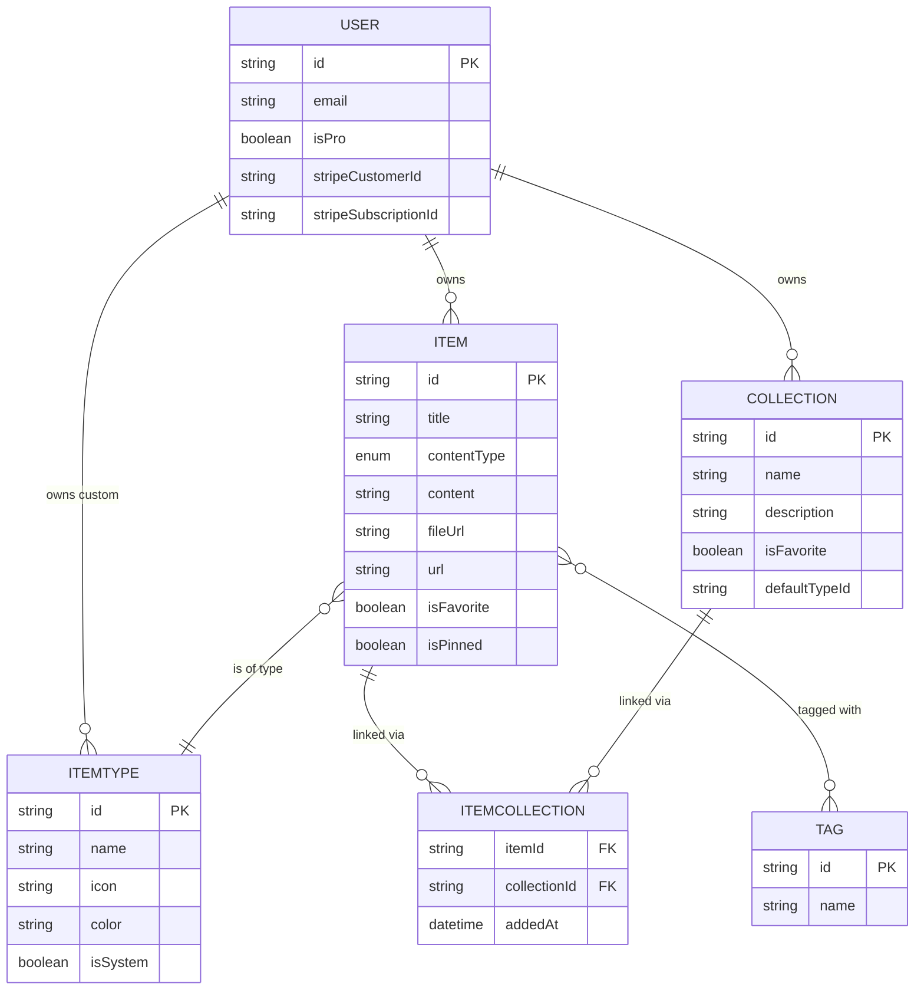

# 📦 DevStash — Project Overview

> One fast, searchable, AI-enhanced hub for all your developer knowledge & resources.

---

## 🎯 The Problem

Developers keep their essentials scattered across too many tools:

| Resource | Usually Lives In |
|---|---|
| 🧩 Code snippets | VS Code, Notion |
| 🤖 AI prompts | ChatGPT/Claude chats |
| 📄 Context files | Buried in projects |
| 🔗 Useful links | Browser bookmarks |
| 📚 Docs | Random folders |
| 💻 Commands | `.txt` files, bash history |
| 🏗️ Project templates | GitHub gists |

The result: **context switching, lost knowledge, and inconsistent workflows.**

DevStash solves this by providing a single, fast, AI-enhanced home for everything a developer wants to keep close at hand.

---

## 👥 Target Users

- **Everyday Developer** — Wants a fast way to grab snippets, prompts, commands, and links.
- **AI-first Developer** — Saves prompts, contexts, workflows, and system messages.
- **Content Creator / Educator** — Stores code blocks, explanations, and course notes.
- **Full-stack Builder** — Collects patterns, boilerplates, and API examples.

---

## ✨ Features

### A. Items & Item Types

Every saved resource is an **Item**. Items have a **type** that determines how they behave and how they're displayed.

**System types** (cannot be edited or deleted):

| Type | Content | Icon | Color | Hex |
|---|---|---|---|---|
| Snippet | text | `Code` | Blue | `#3b82f6` |
| Prompt | text | `Sparkles` | Purple | `#8b5cf6` |
| Command | text | `Terminal` | Orange | `#f97316` |
| Note | text | `StickyNote` | Yellow | `#fde047` |
| Link | url | `Link` | Emerald | `#10b981` |
| File 🔒 | file | `File` | Gray | `#6b7280` |
| Image 🔒 | file | `Image` | Pink | `#ec4899` |

> 🔒 = Pro-only types

Users will eventually be able to create **custom types** (Pro feature, future release).

**Item URLs** follow the pattern: `/items/snippets`, `/items/prompts`, etc.

Items should be **quick to view, create, and edit** via a drawer interface.

---

### B. Collections

A **Collection** is a named group that can hold items of any type. An item can belong to multiple collections.

> 💡 Example: a React custom hook snippet could live in both **"React Patterns"** and **"Interview Prep"** at the same time.

Examples:
- React Patterns (snippets, notes)
- Context Files (files)
- Python Snippets (snippets)
- Prototype Prompts (prompts)

---

### C. Search

Powerful search across:
- 📝 Content
- 🏷️ Tags
- 📛 Titles
- 🗂️ Types

---

### D. Authentication

- Email + password
- GitHub OAuth

Powered by **NextAuth v5**.

---

### E. Quality-of-Life Features

- ⭐ Favorite collections and items
- 📌 Pin items to the top
- 🕒 Recently used view
- 📥 Import code from a file
- ✍️ Markdown editor for text-based types
- 📤 File upload for `file` / `image` types
- 📦 Export data in multiple formats
- 🌙 Dark mode (default for devs), light mode optional
- 🔀 Add/remove items across multiple collections
- 🗂️ View which collections each item belongs to

---

### F. AI Features (Pro Only)

Powered by **OpenAI `gpt-5-nano`**:

- 🏷️ AI auto-tag suggestions
- 📝 AI summaries
- 💡 "Explain this code"
- ✨ Prompt optimizer

---

## 🗄️ Data Model

### Entity Relationship Diagram



### Prisma Models (Draft)

```prisma
// schema.prisma

model User {
  id                   String    @id @default(cuid())
  email                String    @unique
  name                 String?
  image                String?
  emailVerified        DateTime?

  // Pro / billing
  isPro                Boolean   @default(false)
  stripeCustomerId     String?   @unique
  stripeSubscriptionId String?   @unique

  // Relations
  accounts    Account[]
  sessions    Session[]
  items       Item[]
  collections Collection[]
  itemTypes   ItemType[]   // custom types per user; null for system types

  createdAt DateTime @default(now())
  updatedAt DateTime @updatedAt
}

model Item {
  id          String   @id @default(cuid())
  title       String
  description String?

  contentType ItemContentType  // text | file | url
  content     String?          // for text types
  fileUrl     String?          // R2 URL for file types
  fileName    String?
  fileSize    Int?             // bytes
  url         String?          // for link types

  language    String?          // optional, for syntax highlighting

  isFavorite  Boolean  @default(false)
  isPinned    Boolean  @default(false)

  // Relations
  userId      String
  user        User     @relation(fields: [userId], references: [id], onDelete: Cascade)

  itemTypeId  String
  itemType    ItemType @relation(fields: [itemTypeId], references: [id])

  collections ItemCollection[]
  tags        Tag[]            @relation("ItemTags")

  createdAt   DateTime @default(now())
  updatedAt  DateTime @updatedAt

  @@index([userId])
  @@index([itemTypeId])
}

enum ItemContentType {
  TEXT
  FILE
  URL
}

model ItemType {
  id       String  @id @default(cuid())
  name     String
  icon     String  // lucide icon name
  color    String  // hex
  isSystem Boolean @default(false)

  // null for system types, set for user-created custom types
  userId   String?
  user     User?   @relation(fields: [userId], references: [id], onDelete: Cascade)

  items    Item[]

  @@unique([userId, name])
}

model Collection {
  id            String   @id @default(cuid())
  name          String
  description   String?
  isFavorite    Boolean  @default(false)
  defaultTypeId String?  // ItemType to default to when collection has no items

  userId        String
  user          User     @relation(fields: [userId], references: [id], onDelete: Cascade)

  items         ItemCollection[]

  createdAt     DateTime @default(now())
  updatedAt     DateTime @updatedAt

  @@index([userId])
}

model ItemCollection {
  itemId       String
  collectionId String
  addedAt      DateTime @default(now())

  item       Item       @relation(fields: [itemId], references: [id], onDelete: Cascade)
  collection Collection @relation(fields: [collectionId], references: [id], onDelete: Cascade)

  @@id([itemId, collectionId])
  @@index([collectionId])
}

model Tag {
  id    String @id @default(cuid())
  name  String @unique
  items Item[] @relation("ItemTags")
}
```

> ⚠️ **Migration policy:** Never use `prisma db push` or modify the DB schema directly. All schema changes go through `prisma migrate` — run migrations in dev first, then in prod.

---

## 🛠️ Tech Stack

### Framework
- [**Next.js 16**](https://nextjs.org/docs) + **React 19**
- SSR pages with dynamic client components
- API routes for backend (items, file uploads, AI calls)
- One repo, one codebase
- [**TypeScript**](https://www.typescriptlang.org/docs/) for type safety

### Database & ORM
- [**Neon**](https://neon.tech/docs) — PostgreSQL in the cloud
- [**Prisma 7**](https://www.prisma.io/docs) — ORM (fetch latest docs before scaffolding)
- **Redis** for caching *(maybe / phase 2)*

### File Storage
- [**Cloudflare R2**](https://developers.cloudflare.com/r2/) for user file & image uploads

### Authentication
- [**NextAuth v5**](https://authjs.dev/)
- Email/password
- GitHub OAuth

### AI
- [**OpenAI**](https://platform.openai.com/docs) — `gpt-5-nano`

### Styling
- [**Tailwind CSS v4**](https://tailwindcss.com/docs)
- [**shadcn/ui**](https://ui.shadcn.com/) components

### Payments
- [**Stripe**](https://docs.stripe.com/) for subscriptions

---

## 💰 Monetization (Freemium)

| | **Free** | **Pro** |
|---|---|---|
| **Price** | $0 | **$8 / month** or **$72 / year** |
| Items | 50 total | Unlimited |
| Collections | 3 | Unlimited |
| System types | All except File / Image | All |
| File & Image uploads | ❌ | ✅ |
| Custom types | ❌ | ✅ *(coming soon)* |
| AI auto-tagging | ❌ | ✅ |
| AI code explanation | ❌ | ✅ |
| AI prompt optimizer | ❌ | ✅ |
| Export data (JSON / ZIP) | ❌ | ✅ |
| Search | Basic | Full |
| Support | Community | Priority |

> 🚧 **During development:** all users have access to all features. Pro infrastructure (Stripe, gating logic) should be wired up but disabled / bypassed until launch.

---

## 🎨 UI / UX

### Style Direction
- Modern, minimal, developer-focused
- **Dark mode by default**, light mode optional
- Clean typography, generous whitespace
- Subtle borders and shadows
- Syntax highlighting for code blocks
- **References:** [Notion](https://notion.so), [Linear](https://linear.app), [Raycast](https://raycast.com)

### Layout

```
┌─────────────┬──────────────────────────────────────────┐
│             │  Search / Header                         │
│   SIDEBAR   ├──────────────────────────────────────────┤
│             │                                          │
│  ▸ Snippets │  📁 Collections (grid of cards)          │
│  ▸ Prompts  │  ┌────────┐ ┌────────┐ ┌────────┐        │
│  ▸ Commands │  │ React  │ │ Python │ │ Prompts│        │
│  ▸ Notes    │  │Patterns│ │Snippets│ │ Library│        │
│  ▸ Links    │  └────────┘ └────────┘ └────────┘        │
│  ▸ Files    │                                          │
│  ▸ Images   │  📋 Items (color-coded cards)            │
│             │  ┌────────┐ ┌────────┐ ┌────────┐        │
│  Collections│  │snippet │ │ prompt │ │command │        │
│  ▸ Recent   │  └────────┘ └────────┘ └────────┘        │
│  ▸ Favs     │                                          │
└─────────────┴──────────────────────────────────────────┘
```

- **Sidebar (collapsible):** item types with links, latest collections, favorites
- **Main:** grid of collection cards — background color reflects the most common item type inside
- **Item cards:** border color matches their type
- **Item detail:** opens in a quick-access **drawer** (not a full page navigation)

### Responsive
- Desktop-first, but fully mobile-usable
- Sidebar collapses into a slide-in drawer on mobile

### Micro-interactions
- Smooth transitions
- Hover states on all cards
- Toast notifications for actions (save, delete, copy, etc.)
- Loading skeletons on data fetch

---

## 🚦 Build Order (Suggested)

1. **Foundation** — Next.js + TS + Tailwind + shadcn + Prisma + Neon
2. **Auth** — NextAuth v5 (email/password + GitHub)
3. **Schema & migrations** — Users, Items, ItemTypes (seed system types), Collections, Tags
4. **Item CRUD** — drawer UI, markdown editor, syntax highlighting
5. **Collections CRUD** — grid layout, item-collection linking
6. **Search** — content/tag/title/type
7. **File uploads** — Cloudflare R2 wiring
8. **Stripe** — subscriptions, webhooks, `isPro` gating logic
9. **AI features** — auto-tags, summaries, explain, prompt optimizer
10. **Polish** — export, recently used, pinning, favorites, mobile drawer